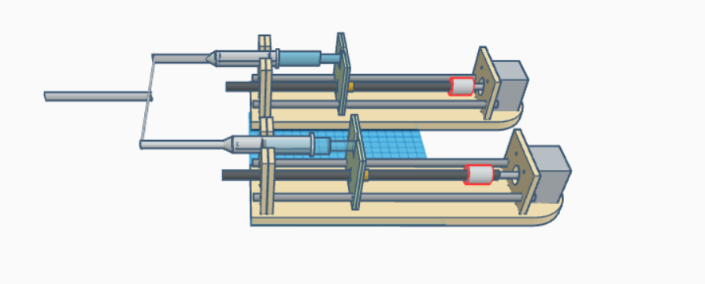

# **Smart Infusion Pump System**

#### **Introduction**  
This project involves designing and implementing a hardware-based infusion pump system. The primary goal is to deliver liquid drugs to a patient with precise control over the **flow rate** or **volume** of the liquid. The system can sense and display the controlled parameters on an LCD screen, ensuring that the pre-adjusted value matches the sensed value. Additionally, an alarm mechanism alerts the user to any anomalies.  

We were permitted to use software tools to simulate the hardware design. Therefore, the project is implemented using simulation software.

---

#### **Key Features**  

1. **Flow Rate and Volume Control**  
   - Users can set the flow rate or volume of the drug to be infused.  
   - The device ensures accurate delivery by continuously monitoring these parameters.  

2. **Parameter Sensing**  
   - The system senses the actual flow rate or volume during operation.  
   - Displays both the **pre-adjusted parameter value** and the **sensed value** on an LCD screen.  

3. **Alarm System**  
   - An audible alarm is triggered in case of discrepancies between the pre-set and sensed values or other errors like blockage or empty syringe.  

4. **Dual-Syringe Mixing Capability** *(Proposed Feature)*  
   - Two syringes can infuse different drugs simultaneously into a third reservoir.  
   - This feature facilitates the controlled mixing of two drugs before delivery, enhancing its effectiveness for complex medical treatments.  

#### **Software Implementation**  
Here you can find the simulation: https://www.tinkercad.com/things/8pqUxLzRyC0/edit?returnTo=%2Fdashboard%2Fdesigns%2F3d&sharecode=CbWtEtqH9fA_tGFuja5iXvyEa5F4ZB6Wkc0McLfshGo

#### **Software Simulation Highlights**  
- The dual-syringe mechanism was simulated to demonstrate the functionality of mixing two drugs in a third chamber.  
- Real-time feedback loops were implemented to ensure the sensed and displayed parameters align closely. 

---

#### **Advantages of the Proposed Feature**  
- **Enhanced Treatment Flexibility**: Supports complex treatments that require the combination of two drugs.  
- **Efficiency**: Reduces manual preparation time for mixing drugs.  
- **Precision**: Ensures controlled and accurate mixing ratios, minimizing errors.  

